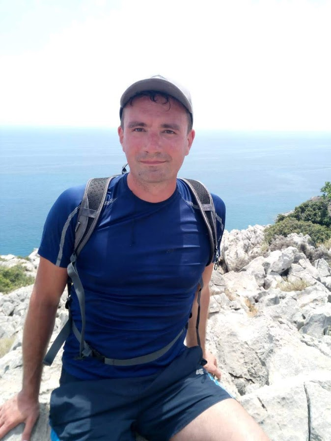
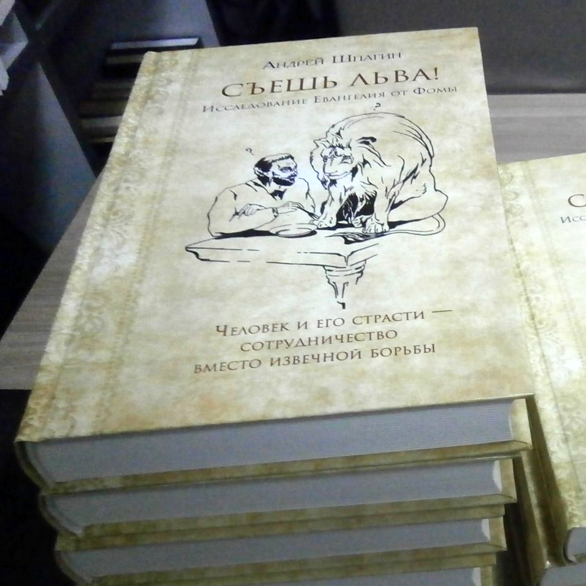

## Hi! I am Andrew Shpagin.

I am mostly c++ developer, but I like javascript as well, mostly for fun)
I am currently the owner and lead programmer of the 3D-Coat (3D-modeling package), so this is my main business. In the past, as the lead programmer in GSC, I made several famous games - Cossacks (all series), American Conquest, Alexander, HOAE, Warcraft 2000. Also, I wrote the book "Consume the lion" about the apocrific Thomas Gospel. There is a youtube channel and the book for free download.

I have a great family, really pretty wife, 4 kids, 3 of them like programming, another one - chess)
The ring of my interests - traveling, 3d-printing, 3d-graphics, machine learning, automating the house, aquarium, physics, math, psychology, mind-programming, polyamory.

  

